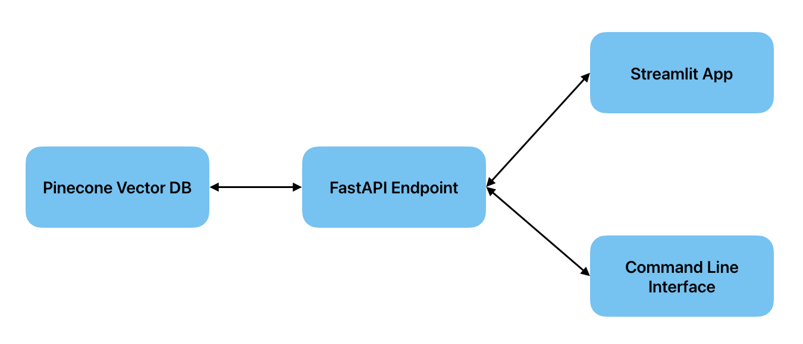

# **SHL Assessment Recommender Demo**

This is a write-up about a demo application which recommends **SHL Individual Test Solutions** based on a natural language query or job description or a URL containing job description. The development of this application can be divided into three parts:
1. **Web scraping**: Identifying and getting the required data (outlined in the problem statement) from the web.
2. **Data Ingestion**: Storing the scraped data in an appropriate form i.e., vector embeddings, in an index for querying.
3. **Infenrence**: Developing an API endpoint (back-end) and a front-end application to query the data.

## **Web scraping**
**Libraries used**: `requests`, `beautifulsoup4`, `pandas`

The basic data (Name, URL, Remote Testing, Adaptive/IRT, Test Type) about each assessment solution is present in a tabular format with pagination on the [website](https://www.shl.com/solutions/products/product-catalog/). Using `beautifulsoup4` and Python built-in `requests` library, the appropirate data is scraped and loaded into a pandas dataframe and finally stored in a CSV file. A detailed description of each product is found in their product page which was scraped and augmented to the CSV file. Further, features like **assessment time** were later extracted from the product description using *regular expressions*.

## **Data Ingestion**
**Libraries and models used**: `pinecone`, `llama-text-embed-v2` (vector dim: 1024), `sentence-transformer`, `pandas`

The product descriptions in the CSV file are used for generating vector embeddings using the `llama-text-embed-v2` model hosted on [Pinecone](https://www.pinecone.io/). The vectors and along with the meta data are then *upserted* into the Pinecone vector database. Alternatively, the embeddings can also be obtained using a `sentence-transformer` model like `all-MiniLM-L6-v2` to generate the embeddings. However, using the already hosted models is faster.

## **Inference**
**Libraries used:** `pinecone`, `fastapi`, `streamlit`, `sentence-transformer`, `google-genai`, `re`, `requests`

The input user query is first checked for URLs and the job descriptions are extracted using `requests` library and `gemini-2.0-flash` model using a prompt. This extracted text is augmented to the query and the vector embedding is generated using the same feature extraction model used in the data ingestion stage. 

Using Pinecone's inference menthods, the top-k matches (15 in this case) are retrieved based on the *cosine similarity* metric. Then using a reranker model (`bge-reranker-v2-m3`), the results are further reranked and the top 10 results are returned.

||
|:-------:|
|Inference pipeline|

### **Frontend**
The frontend is a **Streamlit** application which takes a user input and displays the best matches. 

### **Backend**
The backend is built using **FastAPI** which serves requests from both the Streamlit app and other clients. The endpoint currently takes a query parameter based on which the recommendations are made.


|      Name     |                             Link                             |
|:-------------:|:------------------------------------------------------------:|
| API endpoint  | https://shl-assessment-recommender-lx8s.onrender.com/search  |
| Streamlit app | https://shl-recommender-streamlit.onrender.com               |
| Github        | https://github.com/Sushanth99/shl-assessment-recommender.git |

**NOTE: The API endpoint and the Streamlit app are deployed on [Render](https://render.com/). The server goes to sleep after 15 minutes of inactivity and it may take upto one minute when you're accessing the links for the first time.**

## **Examples**

The user input can be:
1. A natural language query or a job description: I am hiring for Java developers who can also collaborate effectively with my business teams Looking for an assessment(s) that can be completed in 40 minutes.
2. A URL: Here is a JD text (https://www.linkedin.com/jobs/view/research-engineer-ai-at-shl-4194768899/?originalSubdomain=in), can you recommend some assessment that can help me screen applications. Time
limit is less than 30 minutes.

Using command line interface:
```bash
curl -X 'GET' \
  'https://shl-recommender-streamlit.onrender.com/search?method=rag&query=<YOUR QUERY>' \
  -H 'accept: application/json'
```

Using Python:
```python
import requests
import json
query = "YOUR QUERY"
SEARCH_ENDPOINT = "https://shl-recommender-streamlit.onrender.com/search"
response = requests.get(SEARCH_ENDPOINT, params={"query": query})
hits = json.loads(response.content.decode("utf-8"))
```


